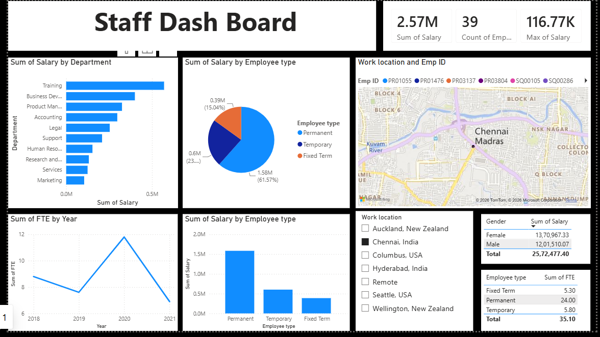
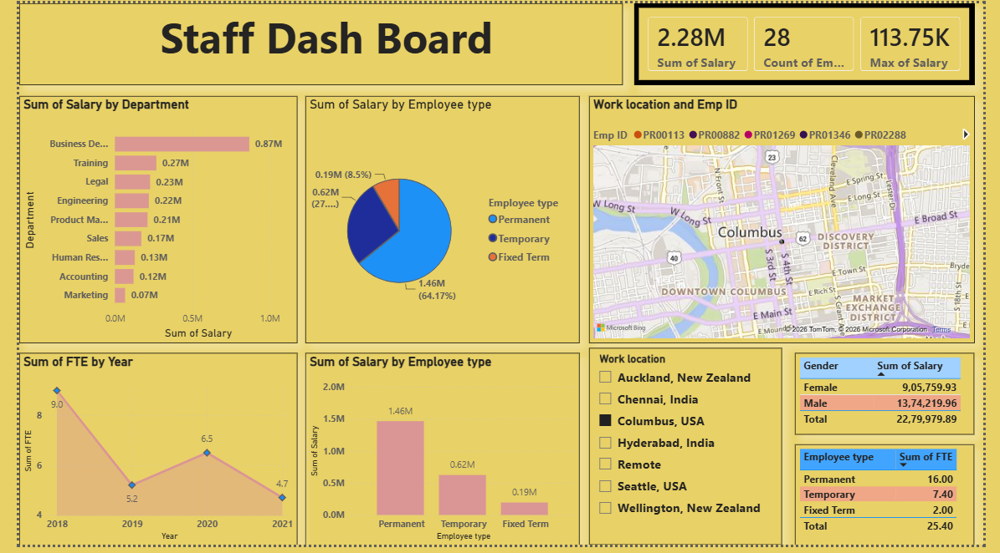

# Staff-Analytics-PowerBI
Interactive Power BI dashboard for analyzing staff salary, departments, employee types, FTE, gender, and work location.
# Staff Analytics Dashboard – Power BI

## 📊 Project Overview

This project presents an interactive **Staff Analytics Dashboard** created using **Microsoft Power BI**.

The dashboard provides insights into employee salary, departments, employee types, FTE, gender, and work location.

## 🛠️ Tools Used

* Microsoft Power BI

## 📌 Key Insights

* Total Salary
* Employee Count
* Maximum Salary
* Salary by Department
* Salary by Employee Type
* FTE by Year
* Gender Analysis
* Work Location Analysis

## 🖥️ Dashboard Preview

### Dashboard – Blue Theme

### Dashboard – Yellow Theme

## 🎨 Dashboard Design

Two visual themes were created using the same dataset to demonstrate different dashboard presentation styles.

## 📁 Project Files

* `Staff_Analytics_Dashboard.pbix` – Power BI dashboard file
* `Dashboard_Blue.png` – Blue theme dashboard preview
* `Dashboard_Yellow.png` – Yellow theme dashboard preview

## 🎯 Objective

The objective of this project is to transform staff data into an interactive and visually appealing dashboard that supports data-driven analysis and decision-making.
